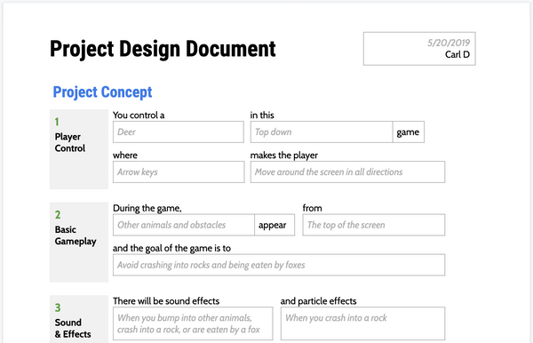
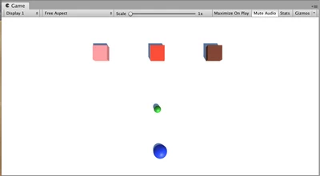

# Overview

 

For these assignments you'll review your work on Labs 1 and 2 from Game Design & Programming 1 - revising them as necessary and then submiting two links:

1. For **0.3a** a shared link to the Google Doc for your PDD.
1. For **0.3b** a link to your personal project repository on GitHub.

<!-- Pull in repostitory-scope variables from _data/page.yml -->
